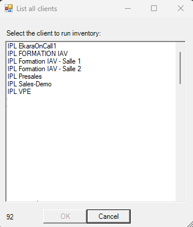
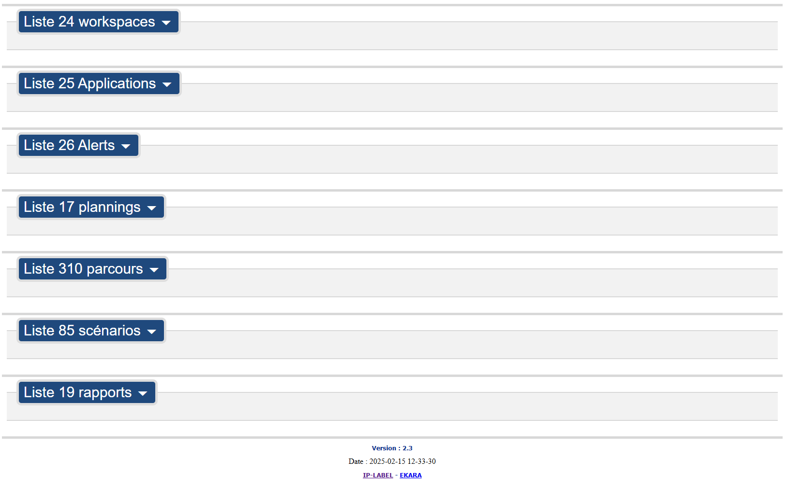
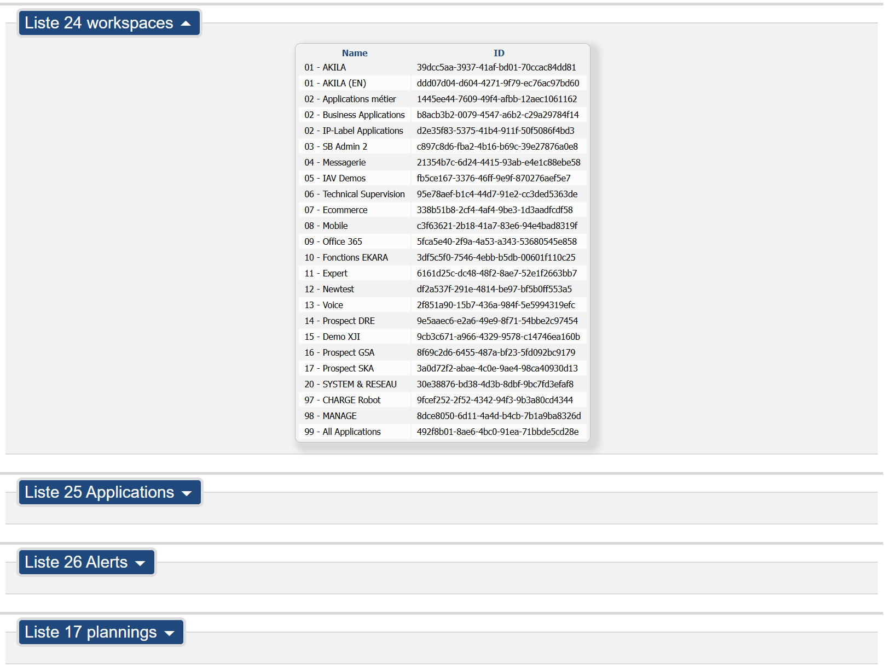

# Ekara-Inventaire_ID

<a href="https://api.ekara.ip-label.net/"> 

## Description
This [Powershell](https://learn.microsoft.com/powershell/scripting/overview) lists the IDS of all [Ekara](https://ekara.ip-label.net/) objects (Applications /Zones / Alters / Plannings / Parcours / workspace) and creates an HTML report. 

For this, the script uses the Rest [Ekara](https://api.ekara.ip-label.net/) API.

## Screens

## Prerequisites

-|version
--|:--:
Ekara plateform|>=24.12
PowerShell|>=5
.NET|>=4
Ekara credentials (Account and password)

## Download

[github-download]: https://github.com/MrGuyTwo/Ekara-Inventaire_ID/releases
 - [`Ekara-Inventaire_ID`][github-download]

## The main function
Methods called : 

- auth/login
- adm-api/clients
- adm-api/applications
- adm-api/zones 
- adm-api/alerts 
- adm-api/plannings 
- script-api/scripts 
- results-api/scenarios/status 
- adm-api/reports/schedules 
- adm-api/workspace
